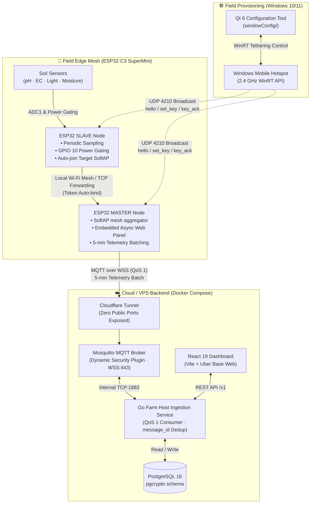
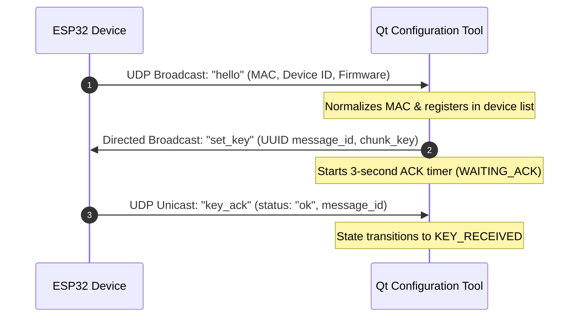

<p align="center">
  <h1 align="center">🌱 ESP32-Link — Smart-Farm IoT Stack</h1>
  <p align="center">
    <strong>An end-to-end, edge-to-cloud IoT monitoring and provisioning ecosystem for precision agriculture.</strong>
  </p>
  <p align="center">
    <a href="#system-architecture">Architecture</a> •
    <a href="#components">Components</a> •
    <a href="#hardware--pinout">Hardware & Pinout</a> •
    <a href="#data-contract--protocol">Protocols</a> •
    <a href="#quick-start">Quick Start</a> •
    <a href="#license">License</a>
  </p>
  <p align="center">
    
    
    
    
    
    
    
    
    
  </p>
</p>

---

## 📖 Overview

**ESP32-Link** is a comprehensive, production-grade IoT monitoring stack designed for precision agriculture and potted plant management. It bridges **field sensors**, **cloud analytics**, and **desktop field commissioning** into a seamless, secure, and resilient workflow:

1. **Edge Tier (`/`)**: ESP32-C3 self-organizing mesh network (Master/Slave) with sensor corrosion protection, local web portal, and uplink telemetry via **MQTT over WSS**.
2. **Cloud Tier (`vps/`)**: Go backend service ingesting telemetry into PostgreSQL, protected by Cloudflare Tunnel and Mosquitto **Dynamic Security**, paired with a React/Vite analytics dashboard.
3. **Provisioning Tier (`windowConfig/`)**: Qt 6 / C++17 Windows desktop application that automates Windows Mobile Hotspots (2.4 GHz) and broadcasts one-time network keys to field devices over UDP.

| Component | Subdirectory | Primary Tech Stack | Core Role |
|---|---|---|---|
| **ESP32 Firmware** | *(repo root)* | C++ / PlatformIO / Arduino | Reads soil sensors (pH, EC, light, moisture), forms local mesh, batches telemetry, streams over MQTT/WSS. |
| **Farm Host Backend** | [`vps/`](vps/README.md) | Go 1.25+ / PostgreSQL / Mosquitto | Ingests telemetry, deduplicates batches, manages device authentication via Dynamic Security, and exposes REST APIs. |
| **Web Dashboard** | [`vps/frontend/`](vps/README.md#dashboard) | React 19 / TypeScript / Vite / Base Web | Visualizes 24h soil moisture trends, live sensor cards, health metrics, and device status. |
| **Windows Config Tool** | [`windowConfig/`](windowConfig/README.md) | Qt 6 / C++17 / WinRT / CMake | Automates 2.4 GHz Windows Hotspot, registers devices via UDP 4210, and provisions one-time keys with 3s ACK. |

---

## 🌿 Smart Irrigation, Adaptive AI & Plant Traceability

The next Smart-Farm capability layer is designed around an independent
`plant_id` for every pot, bed, or growing zone. Each zone keeps its own sensor
calibration, irrigation settings, learning history, and audit trail; one
plant's readings must never trigger another plant's valve.

### Auto irrigation (安全自動澆水)

- Use soil moisture, a configured minimum/target range, and an individual
  zone's sensor health to decide whether irrigation is needed.
- Enforce a maximum pump/valve runtime, post-watering cooldown, and
  water-tank/sensor fault interlocks. A watchdog must turn the output off when
  the allowed duration expires, including after network loss.
- Keep automation **disabled by default**. An operator explicitly enables it
  for each `plant_id` only after checking the GPIO, relay, valve and pipe
  mapping.

### Adaptive learning (AI 自我學習)

Rather than allowing an opaque model to control hardware, the controller
learns bounded, explainable parameters for each plant: its observed soil-dry
rate and moisture gain per second of irrigation. Those values can slightly
adjust the watering trigger for fast-drying zones, but never beyond the
operator's safe min/target range. Every decision should retain its input
readings, model version, calculated threshold, and reason so it can be
reviewed or rolled back.

### Multi-plant hash chain (多植物區塊鏈追溯)

Each `plant_id` maintains an independent append-only event chain:

```text
Plant A: configuration → sensor reading → AI decision → watering start → watering stop
Plant B: configuration → sensor reading → AI decision → alert
                         └─ separate SHA-256-linked chain per plant_id
```

The event payload includes the previous hash and its own SHA-256 hash. Store
the canonical chain in the cloud database, and let ESP32/Raspberry Pi retain a
small offline queue for later upload. This provides tamper-evident traceability
for settings, readings, watering operations, and fault alerts while preserving
field operation during an uplink outage.

---

## 🏗 System Architecture



---

## ✨ Key Features

### 1. ESP32-C3 Firmware (Root)
- **Master / Slave Dual Roles**:
  - **MASTER**: Emits SoftAP `NODE_<id>`, connects to uplink router/hotspot, collects readings from bound slaves, and securely uploads 5-minute batched telemetry over **MQTT over WSS**.
  - **SLAVE**: Scans for `NODE_<targetId>`, joins as STA, auto-authenticates via handshake token, reads sensors, and relays telemetry upstream.
- **Hardware Power Gating**: Drives sensor VCC via **GPIO 10**, turning on sensors only during ADC measurement to prevent soil probe electrolysis and conserve battery life.
- **Pure ADC1 Pin Assignment**: Uses only `ADC1` channels (`GPIO 0, 1, 3`) to eliminate Wi-Fi ADC2 resource conflicts.
- **Onboard Embedded Web Portal**: Accessible at `http://<node-ip>/` (`ESPAsyncWebServer`), offering live Wi-Fi scanning, role configuration, relay debugging, and WebSocket streaming (`/ws`).
- **Emergency Hardware Setup Mode**: Pull **GPIO 6** LOW at boot to bypass stored NVS credentials and enter rescue setup mode.

### 2. VPS Backend & Web Dashboard (`vps/`)
- **High-Throughput Go Ingestion Service**: Subscribes to `farm/v1/masters/{master_id}/telemetry` with MQTT QoS 1 and performs idempotent storage using `message_id` deduplication.
- **Mosquitto Dynamic Security**: Dynamically issues per-device credentials and strict publish ACLs without restarting the broker.
- **Zero-Trust Network Ingress**: Uses **Cloudflare Tunnel** for encrypted inbound traffic—no open firewall ports on the VPS. Admin APIs are shielded by **Cloudflare Access JWT**.
- **Device Enrollment Flow**: One-time enrollment token verification (`/v1/device/master-enrollments`, `/v1/device/slave-enrollments`) with SHA-256 hashed secret validation.
- **Modern SaaS Dashboard**: React 19 + Vite frontend rendering 24h soil moisture trends, temperature/humidity, pH/EC indicators, and offline alert thresholds.

### 3. Windows Configuration Tool (`windowConfig/`)
- **Native Hotspot Automation**: Uses Windows Runtime (`NetworkOperatorTetheringManager`) APIs to auto-start a 2.4 GHz hotspot with custom SSID/passphrase.
- **Directed UDP Broadcast (Port 4210)**: Sends configuration packets directly to `192.168.137.255`, preventing interference with active VPNs or secondary network adapters.
- **Robust 3-Second ACK State Machine**: Transitions devices across `ONLINE` ➔ `WAITING_ACK` ➔ `KEY_RECEIVED` (or `TIMEOUT`/`ERROR`), backed by MAC normalization and JSON persistence.
- **Hardware-Free Python Simulators**: Bundles mock scripts (`esp32_simulator.py`, `test_udp_handshake.py`) to test provisioning of 3–10 simulated nodes in CI/CD without physical boards.

---

## 🔌 Hardware & Pinout Specifications

The firmware is optimized for the **ESP32-C3 SuperMini** / **ESP32-C3-DevKitM-1**:

| Pin | Function | Electrical Characteristic | Description |
|---|---|---|---|
| **GPIO 0** | Soil pH Sensor | ADC1_CH0 (Analog In) | Connects to pH sensor analog output (0–14 pH). |
| **GPIO 1** | Ambient Light Sensor | ADC1_CH1 (Analog In) | Connects to photoresistor / ambient light sensor (lux). |
| **GPIO 3** | Soil Moisture Sensor | ADC1_CH3 (Analog In) | Connects to capacitive soil moisture sensor (0–100%). |
| **GPIO 6** | Setup Mode Jumper | Digital In (Active-Low) | Pull to GND during boot to force Setup Mode. |
| **GPIO 8** | Status LED | Digital Out (Active-Low) | Onboard indicator LED (SuperMini built-in). |
| **GPIO 10** | Sensor Power Control | Digital Out (Push-Pull) | Sensor VCC power switch (HIGH = active, LOW = power cut). |

---

## 📡 Data Contracts & Protocols

### 1. MQTT Telemetry Payload (`MQTT over WSS`)
Published by the **Master Node** every 5 minutes to `farm/v1/masters/{master_id}/telemetry`:

```json
{
  "message_id": "e17e9b29-1d03-4b85-a166-c204a2466a09",
  "measured_at": "2026-09-06T08:00:00Z",
  "firmware_version": "master-1.0.0",
  "readings": [
    {
      "slave_id": "slave-001",
      "ph": 6.5,
      "ec_ms_per_cm": 1.35,
      "light_lux": 1250,
      "soil_moisture_percent": 48.2,
      "calibration_version": "2026-09-01",
      "firmware_version": "slave-1.0.0"
    }
  ]
}
```

### 2. Windows UDP Provisioning Handshake (`UDP 4210`)



---

## 📂 Repository Structure

```text
ESP32-link/
├── platformio.ini           # PlatformIO build configuration (esp32-c3-devkitm-1)
├── src/                     # ESP32 C++ firmware
│   ├── main.cpp             # System initialization & state loops
│   ├── config/              # NVS config storage & CA certificates
│   ├── datapacket/          # Telemetry & provisioning data layouts
│   ├── hardware/            # Sensor drivers, ADC1 reader, GPIO 10 power gating
│   ├── math/                # Calibration curves, moving average filters, conversions
│   ├── mqtt/                # MQTT over WSS client implementation
│   ├── network/             # AP & STA controllers, mesh router, host uplink
│   └── webservice/          # Embedded async HTTP server & WebSocket routes
├── lib/                     # Reusable firmware helper libraries
├── tools/                   # Firmware verification & host ingest testing scripts
├── vps/                     # Cloud Backend (Go + PostgreSQL + Mosquitto)
│   ├── cmd/host/            # Go backend entrypoint
│   ├── internal/            # Telemetry consumer, Dynamic Security, enrollment APIs
│   ├── migrations/          # PostgreSQL schema migrations (pgcrypto)
│   ├── deploy/mosquitto/    # Mosquitto config with Dynamic Security plugin
│   ├── docker-compose.yml   # Multi-service cloud deployment manifest
│   └── frontend/            # React 19 + Vite dashboard application
└── windowConfig/            # Windows Hotspot & Key Broadcast Manager
    ├── CMakeLists.txt       # CMake build config (Qt 6 / C++17)
    ├── src/                 # Qt GUI, WinRT hotspot controller, UDP protocol
    ├── esp32/               # Companion Arduino sketch (esp32_udp_client.ino)
    ├── scripts/             # PowerShell hotspot helper scripts
    └── tools/               # Multi-node Python UDP simulators & protocol tests
```

---

## 🚀 Quick Start

### 1. Flash ESP32 Firmware
Ensure you have [PlatformIO](https://platformio.org/) installed:

```bash
# Build firmware
pio run

# Flash to ESP32-C3 (SuperMini / DevKitM-1)
pio run -t upload

# Open serial console (115200 baud)
pio device monitor
```
Connect to the node's Wi-Fi access point (`NODE_<id>`) and open `http://192.168.4.1/` in your browser to configure network credentials and device role.

---

### 2. Deploy VPS Backend
Requirements: **Docker** & **Docker Compose**.

```bash
cd vps

# 1. Prepare environment variables
cp .env.example .env
# Edit .env with your PostgreSQL credentials, Cloudflare Tunnel token, etc.

# 2. Start Mosquitto, PostgreSQL, Go Backend & React Dashboard
docker compose up --build -d

# 3. Verify backend health
curl http://127.0.0.1:8080/healthz
# Response: {"status":"healthy"}
```

To run the frontend dashboard locally in development mode:
```bash
cd vps/frontend
npm install
VITE_API_PROXY_TARGET=http://127.0.0.1:8080 npm run dev
```

---

### 3. Run Windows Configuration Tool
Requirements: **Windows 10/11**, **Qt 6.x**, **CMake 3.16+**, **MSVC 2022** or **MinGW 64-bit**.

**Using Qt Creator:**
1. Open `windowConfig/CMakeLists.txt` in Qt Creator.
2. Select the **Desktop Qt 6.x 64-bit** kit.
3. Click **Run (Ctrl + R)**.

**Using Command Line:**
```cmd
cd windowConfig
mkdir build && cd build
cmake .. -G "Ninja" -DCMAKE_BUILD_TYPE=Release
ninja
.\ESP32QtApp.exe
```

---

### 4. Test Without Physical Hardware (Python Simulators)
You can test the entire UDP provisioning workflow without ESP32 hardware:

```bash
# 1. Start 3 virtual ESP32 nodes (with simulated timeout and error nodes)
python windowConfig/tools/esp32_simulator.py --count 3 --timeout-node 2 --error-node 3

# 2. In another terminal, run the automated handshake tester
python windowConfig/tools/test_udp_handshake.py
```

---

## 🛡 Security & Reliability

- **Transport Security**: Telemetry leaves the agricultural field strictly over **TLS/WSS (Port 443)** through Cloudflare Tunnel. No open inbound ports are required on the VPS.
- **Dynamic Access Control**: Mosquitto Dynamic Security assigns specific publish privileges per Master ID (`farm/v1/masters/{master_id}/telemetry`), preventing compromised nodes from impersonating others.
- **Idempotency**: All telemetry batches carry a UUIDv4 `message_id`. The Go backend automatically discards duplicate arrivals caused by network retries.
- **Offline Mesh Resilience**: Master nodes buffer sensor readings locally if uplink connectivity drops and replay them once reconnected.

---

## 📄 License

This project is licensed under the [MIT License](LICENSE) — see the [LICENSE](LICENSE) file for details.
