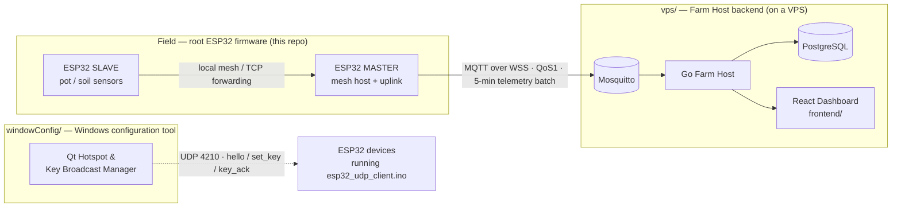

# ESP32-Link — Smart-Farm IoT Stack

A single repository that **links three components of one smart-farm / plant-monitoring
system** end to end:

| Folder | Component | Role |
|---|---|---|
| *(repo root)* | **ESP32 firmware** | ESP32-C3 master/slave mesh that reads soil sensors on potted plants |
| [`vps/`](vps/README.md) | **Farm Host backend** | Go + PostgreSQL server on a VPS that ingests the telemetry |
| [`windowConfig/`](windowConfig/README.md) | **Windows config tool** | Qt desktop app that manages a 2.4 GHz hotspot & broadcasts keys to ESP32 devices |

The three pieces talk to each other as shown below; each folder keeps its own
full documentation and is linked from this overview.



## Repository layout

```
ESP32-link/
├── README.md                ← this overview (the three parts above)
├── platformio.ini           # root ESP32 firmware build config
├── src/                     # firmware source (mesh, MQTT/WSS, web panel)
├── lib/                     # firmware libraries (config, protocol, drivers…)
├── tools/                   # helper scripts & test tools
├── vps/                     # Farm Host backend (Go / PostgreSQL / Mosquitto)
│   └── frontend/            #   React dashboard
└── windowConfig/            # Qt 6 Windows hotspot & key broadcast manager
    ├── src/                 #   Qt application (C++17)
    ├── esp32/               #   companion esp32_udp_client.ino firmware
    └── tools/               #   Python ESP32 simulators & protocol tests
```

## 1. ESP32 firmware (repo root)

Self-organizing, ID-grouped ESP32-C3 mesh (Arduino framework) with an English
**web control panel** served from the node itself. Two roles:

- **MASTER** — opens a SoftAP `NODE_<id>`, optionally joins an uplink Wi-Fi
  (phone/laptop hotspot or router), collects readings from bound slaves, and
  uploads 5-minute telemetry batches to the backend over **MQTT over WSS**.
- **SLAVE** — scans for `NODE_<targetId>`, connects as STA, auto-binds to the
  master (`hello` with label + transfer token), and forwards soil readings
  (pH, EC, light, soil moisture).

**Build:** `pio run -t upload` (PlatformIO, board `esp32-c3-devkitm-1`).

The web UI is served at `http://<node-ip>/`. Key API endpoints:
`/api/config`, `/api/status`, `/api/scan`, `/api/apply`, `/api/reboot`,
`/api/relay`, `/api/hotspot`, `/api/provision`, `/api/data` plus a live
WebSocket at `/ws`.

> Upstream data path: this firmware ⇄ [`vps/`](vps/README.md) Farm Host backend.

## 2. VPS backend — [`vps/`](vps/README.md)

Go backend that receives the master node's soil telemetry **over MQTT over WSS**
and stores it in PostgreSQL. Includes Mosquitto **Dynamic Security** device
management, master/slave **enrollment APIs**, deduplication by `message_id`,
and a React/Vite dashboard under `vps/frontend/`.

Data model & API details, deployment (Docker Compose + Cloudflare Tunnel) and
the telemetry payload contract are documented in
[`vps/README.md`](vps/README.md).

## 3. Windows config tool — [`windowConfig/`](windowConfig/README.md)

A **Qt 6 / C++17** Windows desktop app: automatically starts the Windows
**Mobile Hotspot (2.4 GHz)**, registers multiple ESP32 devices over **UDP 4210**
with MAC/ID management, and broadcasts a one-time key with a 3-second ACK
state machine (`hello` / `set_key` / `key_ack`). It ships its own companion
firmware (`windowConfig/esp32/esp32_udp_client.ino`) plus Python simulators
for no-hardware testing.

Build & usage instructions are in
[`windowConfig/README.md`](windowConfig/README.md).

## Getting started

1. **Firmware** — open the root folder with PlatformIO (`pio run -t upload`)
   and configure the node from its web panel (uplink SSID, master ID,
   enrollment token).
2. **VPS backend** — follow [`vps/README.md`](vps/README.md) to run
   `docker compose up -d`, apply the PostgreSQL migration and expose the
   MQTT/API hostnames through Cloudflare.
3. **Windows tool** — build `windowConfig/` with Qt Creator / CMake on Windows
   and follow [`windowConfig/README.md`](windowConfig/README.md) to provision
   devices over the hotspot.

## License

`windowConfig/` is MIT licensed (see `windowConfig/LICENSE`). The remaining
components are provided for this hackathon / personal project unless stated
otherwise in their respective folders.

