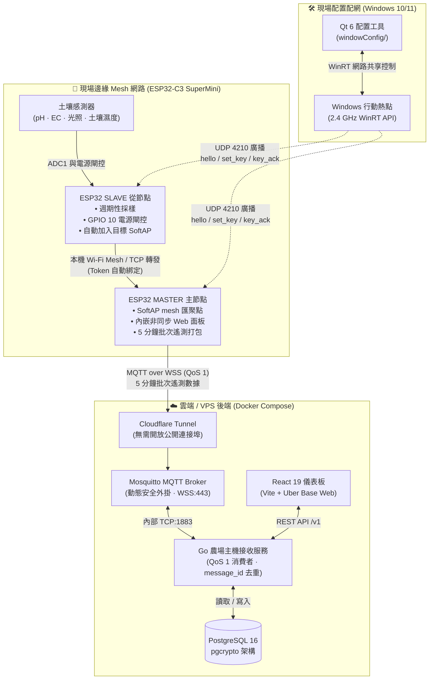
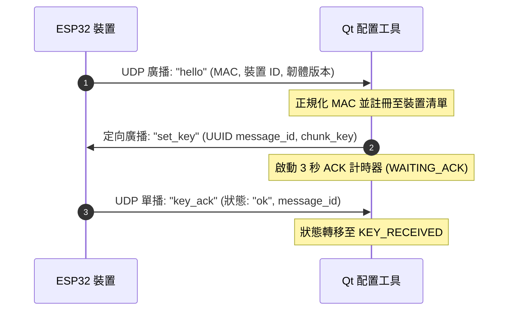

<p align="center">
  <h1 align="center">🌱 ESP32-Link — 智慧農業物聯網全端架構</h1>
  <p align="center">
    <strong>適用於精準農業的端到端、邊緣至雲端（Edge-to-Cloud）監控與裝置配網生態系統。</strong>
  </p>
  <p align="center">
    <a href="#-系統架構">系統架構</a> •
    <a href="#-核心組件">核心組件</a> •
    <a href="#-硬體與腳位規格">硬體與腳位</a> •
    <a href="#-數據契約與通訊協定">通訊協議</a> •
    <a href="#-快速開始">快速開始</a> •
    <a href="#-開源授權">開源授權</a>
  </p>
  <p align="center">
    <a href="README.md">English</a> •
    <a href="README.zh-TW.md">繁體中文</a>
  </p>
  <p align="center">
    
    
    
    
    
    
    
    
    
  </p>
</p>

---

## 📖 概述

**ESP32-Link** 是一套專為精準農業與盆栽管理設計的生產級物聯網監控架構。它將**現場感測器**、**雲端分析**與**桌面現場調試配網**整合成無縫、安全且具備高容錯韌性的工作流程：

1. **邊緣層 (`/`)**：ESP32-C3 自組織網狀網路（Master/Slave 架構），具備感測器抗電解腐蝕保護、本機 Web 控制台，並透過 **MQTT over WSS** 上傳遙測數據。
2. **雲端層 (`vps/`)**：以 Go 編寫的後端服務，將遙測數據持久化至 PostgreSQL，透過 Cloudflare Tunnel 與 Mosquitto **Dynamic Security（動態安全外掛）** 提供保護，並搭配 React/Vite 分析儀表板。
3. **配網層 (`windowConfig/`)**：基於 Qt 6 / C++17 的 Windows 桌面應用程式，自動化控制 Windows 行動熱點（2.4 GHz），並透過 UDP 向現場裝置廣播一次性網路密鑰。

### 核心組件

| 組件 | 子目錄 | 主要技術棧 | 核心角色 |
|---|---|---|---|
| **ESP32 韌體** | *(儲存庫根目錄)* | C++ / PlatformIO / Arduino | 讀取土壤感測器（pH、EC、光照、土壤濕度），組建本機 Mesh 網路，批次打包遙測數據，透過 MQTT/WSS 串流傳輸。 |
| **農場雲端後端** | [`vps/`](vps/README.md) | Go 1.25+ / PostgreSQL / Mosquitto | 接收遙測數據、批次去重、透過動態安全外掛管理裝置認證，並提供 REST API。 |
| **Web 監控儀表板** | [`vps/frontend/`](vps/README.md#dashboard) | React 19 / TypeScript / Vite / Base Web | 視覺化呈現 24 小時土壤濕度趨勢、即時感測器卡片、健康指標與裝置連線狀態。 |
| **Windows 配網工具** | [`windowConfig/`](windowConfig/README.md) | Qt 6 / C++17 / WinRT / CMake | 自動化控制 2.4 GHz Windows 熱點，透過 UDP 4210 註冊裝置，並在 3 秒 ACK 機制下下發一次性密鑰。 |

---

## 🌿 智慧灌溉、自適應 AI 與植物追溯

次世代智慧農場功能以獨立的 `plant_id` 為核心設計，適用於各個花盆、苗床或種植分區。各分區維持獨立的感測器校準、灌溉設定、學習歷程與稽核軌跡；單一植物的數值絕不會誤觸發其他植物的閥門。

### 安全自動澆水 (Auto irrigation)

- 依據土壤濕度、預設的安全最小／目標範圍，以及該分區的感測器健康度來判斷是否需要灌溉。
- 強制執行水泵／閥門最大單次運轉時間、澆水後冷卻間隔，以及水箱水位／感測器故障聯鎖機制。看門狗（Watchdog）在達到允許上限時必須強制關閉輸出，即使在網路中斷時亦同。
- 預設維持**關閉自動化**。操作人員必須在確認 GPIO、繼電器、閥門及管路配置正確無誤後，針對個別 `plant_id` 明確啟用。

### AI 自我學習 (Adaptive learning)

系統不採用不透明的模型直接操控硬體，而是為每株植物學習具備邊界限制且可解釋的參數：觀測土壤變乾速率以及每秒灌溉帶來的濕度提升量。這些參數可在安全範圍內微調乾燥分區的澆水觸發閥值，但絕不超出操作人員設定的安全最小／目標區間。每次決策皆會記錄輸入讀數、模型版本、計算所得閾值與決策原因，以便事後審查或回滾。

### 多植物區塊鏈追溯 (Multi-plant hash chain)

每個 `plant_id` 維護獨立且僅限追加（append-only）的事件鏈：

```text
植物 A: 配置設定 → 感測器讀數 → AI 決策 → 啟動灌溉 → 停止灌溉
植物 B: 配置設定 → 感測器讀數 → AI 決策 → 告警通知
         └─ 每個 plant_id 具備獨立的 SHA-256 關聯鏈
```

事件負載包含前一筆事件的雜湊值與自身的 SHA-256 雜湊。權威資料鏈儲存於雲端資料庫中，ESP32／樹莓派等現場設備則保留小型離線佇列以供連線後補傳。這確保了設定、讀數、灌溉動作與故障告警具備防篡改的追溯性，同時在網路斷線時仍可維持現場作業。

### 第二階段 MVP 功能 (MVP experience layer)

以下使用者端功能輕量且易於實作，能在 MVP 階段提供具體且可操作的智慧農場體驗：

| 功能 | MVP 行為表現 |
| --- | --- |
| **植物 QR Code** | 掃描 `plant_id` QR Code 即可查看即時狀態、灌溉紀錄與照護指引。 |
| **一鍵植物設定** | 選擇作物範本，自動預填濕度、光照、pH/EC 範圍及灌溉限制。 |
| **今日待辦任務** | 優先列出低濕度分區、逾期校準、感測器離線及採收提醒。 |
| **植物健康評分** | 綜合濕度、光照、pH、EC、近期告警及連線品質，計算出 0–100 的健康指數。 |
| **病蟲害拍照回報** | 上傳照片並綁定 `plant_id`，建立具追溯性的問題回報單；未來可接入影像 AI 分析。 |
| **用水分析統計** | 比較各分區的每日／每週灌溉頻率與預估用水量，快速找出異常狀況。 |
| **感測器資料品質標籤** | 在數據送入自動化邏輯前，明確標註正常（normal）、過期（stale）、遺失（missing）及跳變／不可信（implausible）狀態。 |
| **審批制 AI 微調** | 呈現建議的閾值調整幅度與依據數據；在操作人員確認前絕不主動套用。 |
| **植物生命週期時序軸** | 在灌溉與感測器歷程旁，同步記錄播種、移植、開花與採收等重大生長事件。 |
| **展示模式 (Demo Mode)** | 在無實體硬體時，模擬多株植物的乾燥曲線、告警事件與灌溉歷程。 |

針對初期的聚焦 MVP，建議優先實作 **植物 QR Code**、**健康評分**、**今日待辦** 與 **展示模式**。這能讓監控、自動化與多植物架構在無須接滿所有感測器或閥門的情況下，即可完整展示核心價值。

---

## 🏗 系統架構



---

## ✨ 主要特色

### 1. ESP32-C3 韌體（專案根目錄）
- **Master / Slave 雙角色架構**：
  - **MASTER（主節點）**：發送 SoftAP `NODE_<id>`，連線至上行路由器／熱點，收集已綁定從節點的讀數，並透過 **MQTT over WSS** 安全上傳 5 分鐘批次遙測數據。
  - **SLAVE（從節點）**：掃描 `NODE_<targetId>`，以 STA 模式加入，透過握手 Token 自動認證，讀取感測器並向上轉發遙測數據。
- **硬體電源閘控（Power Gating）**：透過 **GPIO 10** 控制感測器 VCC 電源，僅在 ADC 取樣測量時通電，有效防止土壤探針電解腐蝕並大幅節省電池電量。
- **純 ADC1 腳位配置**：僅使用 `ADC1` 通道（`GPIO 0, 1, 3`），徹底消除與 Wi-Fi 衝突的 ADC2 資源搶佔問題。
- **板載內嵌式 Web 控制台**：透過瀏覽器存取 `http://<node-ip>/`（基於 `ESPAsyncWebServer`），提供即時 Wi-Fi 掃描、節點角色設定、繼電器調試與 WebSocket 串流（`/ws`）。
- **硬體緊急救援設定模式**：開機時將 **GPIO 6** 接地（PULL LOW）可繞過 NVS 儲存的認證資訊，強制進入救援設定模式。

### 2. VPS 後端與 Web 儀表板 (`vps/`)
- **高吞吐量 Go 遙測接收服務**：以 MQTT QoS 1 訂閱 `farm/v1/masters/{master_id}/telemetry`，並利用 `message_id` 實現等冪（Idempotent）儲存與批次去重。
- **Mosquitto 動態安全管理（Dynamic Security）**：無需重啟 Broker 即可動態簽發個別裝置專屬憑證與嚴格的發布 ACL。
- **零信任網路入口（Zero-Trust Ingress）**：採用 **Cloudflare Tunnel** 加密所有入站流量——VPS 無需在防火牆開啟任何公開連接埠。管理 API 受 **Cloudflare Access JWT** 保護。
- **裝置註冊流程**：具備一次性註冊 Token 驗證機制（`/v1/device/master-enrollments`, `/v1/device/slave-enrollments`），結合 SHA-256 雜湊密鑰校驗。
- **現代化 SaaS 儀表板**：React 19 + Vite 前端，即時繪製 24 小時土壤濕度趨勢、溫濕度、pH/EC 指標及離線告警閾值。

### 3. Windows 配網工具 (`windowConfig/`)
- **原生熱點自動化**：呼叫 Windows Runtime（`NetworkOperatorTetheringManager`）API，自動啟動具備指定 SSID／密碼的 2.4 GHz 熱點。
- **定向 UDP 廣播（連接埠 4210）**：將配置封包直接發送至 `192.168.137.255`，避免與啟動中的 VPN 或第二張網路卡衝突。
- **穩健的 3 秒 ACK 狀態機**：支援裝置狀態平滑切換：`ONLINE` ➔ `WAITING_ACK` ➔ `KEY_RECEIVED`（或 `TIMEOUT`/`ERROR`），並內建 MAC 地址正規化與 JSON 持久化。
- **免硬體 Python 模擬器**：提供模擬腳本（`esp32_simulator.py`, `test_udp_handshake.py`），可在無實體開發板的情況下於 CI/CD 中測試 3–10 個虛擬節點的配網握手流程。

---

## 🔌 硬體與腳位規格

本韌體已針對 **ESP32-C3 SuperMini** / **ESP32-C3-DevKitM-1** 進行最佳化：

| 腳位 | 功能 | 電氣特性 | 說明 |
|---|---|---|---|
| **GPIO 0** | 土壤 pH 感測器 | ADC1_CH0 (類比輸入) | 連接土壤 pH 感測器類比輸出 (0–14 pH)。 |
| **GPIO 1** | 環境光照感測器 | ADC1_CH1 (類比輸入) | 連接光敏電阻／環境光感測器 (lux)。 |
| **GPIO 3** | 土壤濕度感測器 | ADC1_CH3 (類比輸入) | 連接電容式土壤濕度感測器 (0–100%)。 |
| **GPIO 6** | 設定模式跳線 | 數位輸入 (低電位有效 Active-Low) | 開機時拉至 GND 可強制進入設定模式。 |
| **GPIO 8** | 狀態指示燈 | 數位輸出 (低電位有效 Active-Low) | 板載狀態指示 LED (SuperMini 內建)。 |
| **GPIO 10** | 感測器電源控制 | 數位輸出 (推挽式 Push-Pull) | 感測器 VCC 電源開關 (HIGH = 供電, LOW = 斷電)。 |

---

## 📡 數據契約與通訊協定

### 1. MQTT 遙測負載 (`MQTT over WSS`)
由 **Master 主節點** 每 5 分鐘發布至 `farm/v1/masters/{master_id}/telemetry`：

```json
{
  "message_id": "e17e9b29-1d03-4b85-a166-c204a2466a09",
  "measured_at": "2026-09-06T08:00:00Z",
  "firmware_version": "master-1.0.0",
  "readings": [
    {
      "slave_id": "slave-001",
      "ph": 6.5,
      "ec_ms_per_cm": 1.35,
      "light_lux": 1250,
      "soil_moisture_percent": 48.2,
      "calibration_version": "2026-09-01",
      "firmware_version": "slave-1.0.0"
    }
  ]
}
```

### 2. Windows UDP 配網握手 (`UDP 4210`)



---

## 📂 專案目錄結構

```text
ESP32-link/
├── platformio.ini           # PlatformIO 建置設定檔 (esp32-c3-devkitm-1)
├── src/                     # ESP32 C++ 韌體原始碼
│   ├── main.cpp             # 系統初始化與狀態主迴圈
│   ├── config/              # NVS 設定儲存與 CA 憑證
│   ├── datapacket/          # 遙測與配網數據封包結構
│   ├── hardware/            # 感測器驅動程式、ADC1 讀取器、GPIO 10 電源閘控
│   ├── math/                # 校準曲線、移動平均濾波器、數值轉換
│   ├── mqtt/                # MQTT over WSS 用戶端實作
│   ├── network/             # AP 與 STA 控制器、Mesh 路由器、主機上行鏈路
│   └── webservice/          # 內嵌式非同步 HTTP 伺服器與 WebSocket 路由
├── lib/                     # 可重複使用的韌體輔助函式庫
├── tools/                   # 韌體驗證與主機接收測試腳本
├── vps/                     # 雲端後端 (Go + PostgreSQL + Mosquitto)
│   ├── cmd/host/            # Go 後端主程式進入點
│   ├── internal/            # 遙測消費者、動態安全、裝置註冊 API
│   ├── migrations/          # PostgreSQL 資料庫遷移檔案 (pgcrypto)
│   ├── deploy/mosquitto/    # Mosquitto 設定與 Dynamic Security 外掛
│   ├── docker-compose.yml   # 多服務雲端部署設定檔
│   └── frontend/            # React 19 + Vite 儀表板前端應用
└── windowConfig/            # Windows 熱點與金鑰廣播管理工具
    ├── CMakeLists.txt       # CMake 建置設定 (Qt 6 / C++17)
    ├── src/                 # Qt GUI 介面、WinRT 熱點控制器、UDP 協定
    ├── esp32/               # 配套 Arduino 範例 (esp32_udp_client.ino)
    ├── scripts/             # PowerShell 熱點輔助腳本
    └── tools/               # 多節點 Python UDP 模擬器與協定測試工具
```

---

## 🚀 快速開始

### 1. 燒錄 ESP32 韌體
確保系統已安裝 [PlatformIO](https://platformio.org/)：

```bash
# 建置韌體
pio run

# 燒錄至 ESP32-C3 (SuperMini / DevKitM-1)
pio run -t upload

# 開啟序列埠監控視窗 (115200 baud)
pio device monitor
```
連線至節點發送的 Wi-Fi 無線基地台（`NODE_<id>`），並在瀏覽器中開啟 `http://192.168.4.1/` 即可設定網路連線認證與裝置角色。

---

### 2. 部署 VPS 雲端後端
環境需求：**Docker** 與 **Docker Compose**。

```bash
cd vps

# 1. 準備環境變數設定檔
cp .env.example .env
# 編輯 .env 填入 PostgreSQL 密碼、Cloudflare Tunnel Token 等資訊

# 2. 啟動 Mosquitto、PostgreSQL、Go 後端與 React 儀表板
docker compose up --build -d

# 3. 驗證後端健康檢查狀態
curl http://127.0.0.1:8080/healthz
# 回應內容: {"status":"healthy"}
```

若要在本機以開發模式啟動前端儀表板：
```bash
cd vps/frontend
npm install
VITE_API_PROXY_TARGET=http://127.0.0.1:8080 npm run dev
```

---

### 3. 執行 Windows 配網工具
環境需求：**Windows 10/11**、**Qt 6.x**、**CMake 3.16+**、**MSVC 2022** 或 **MinGW 64-bit**。

**使用 Qt Creator：**
1. 在 Qt Creator 中開啟 `windowConfig/CMakeLists.txt`。
2. 選擇 **Desktop Qt 6.x 64-bit** 套件。
3. 點擊 **執行 (Ctrl + R)**。

**使用命令列：**
```cmd
cd windowConfig
mkdir build && cd build
cmake .. -G "Ninja" -DCMAKE_BUILD_TYPE=Release
ninja
.\ESP32QtApp.exe
```

---

### 4. 免實體硬體測試（Python 模擬器）
無需實體 ESP32 硬體即可測試完整的 UDP 配網流程：

```bash
# 1. 啟動 3 個虛擬 ESP32 節點 (包含模擬逾時節點與錯誤節點)
python windowConfig/tools/esp32_simulator.py --count 3 --timeout-node 2 --error-node 3

# 2. 在另一個終端機視窗中，執行自動化握手測試腳本
python windowConfig/tools/test_udp_handshake.py
```

---

## 🛡 安全性與可靠度

- **傳輸層安全（Transport Security）**：現場遙測數據一律透過 Cloudflare Tunnel 以 **TLS/WSS（連接埠 443）** 加密傳輸，VPS 無需開放任何入站連接埠。
- **動態存取控制（Dynamic Access Control）**：Mosquitto Dynamic Security 針對個別 Master ID 分配特定的發布權限（`farm/v1/masters/{master_id}/telemetry`），防止受駭節點偽造其他節點身分。
- **等冪性保證（Idempotency）**：所有批次遙測封包均帶有 UUIDv4 `message_id`。Go 後端會自動過濾因網路重試而重複送達的資料。
- **離線網狀網路韌性（Offline Mesh Resilience）**：當上行網路中斷時，Master 主節點會在本地快取感測器讀數，待連線恢復後自動補傳。

---

## 📄 開源授權

本專案採用 [MIT 授權條款](LICENSE) — 詳細資訊請參閱 [LICENSE](LICENSE) 檔案。
